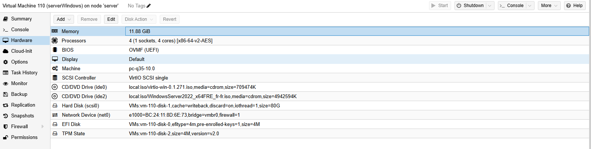
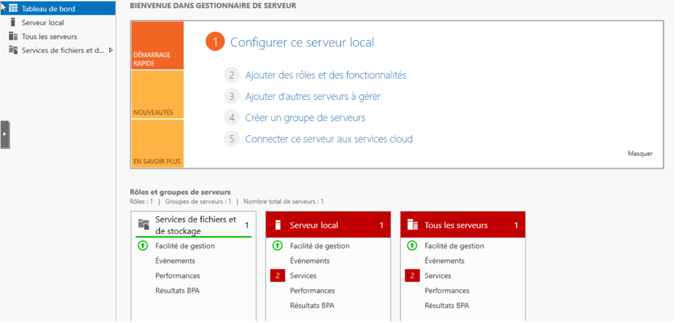
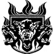
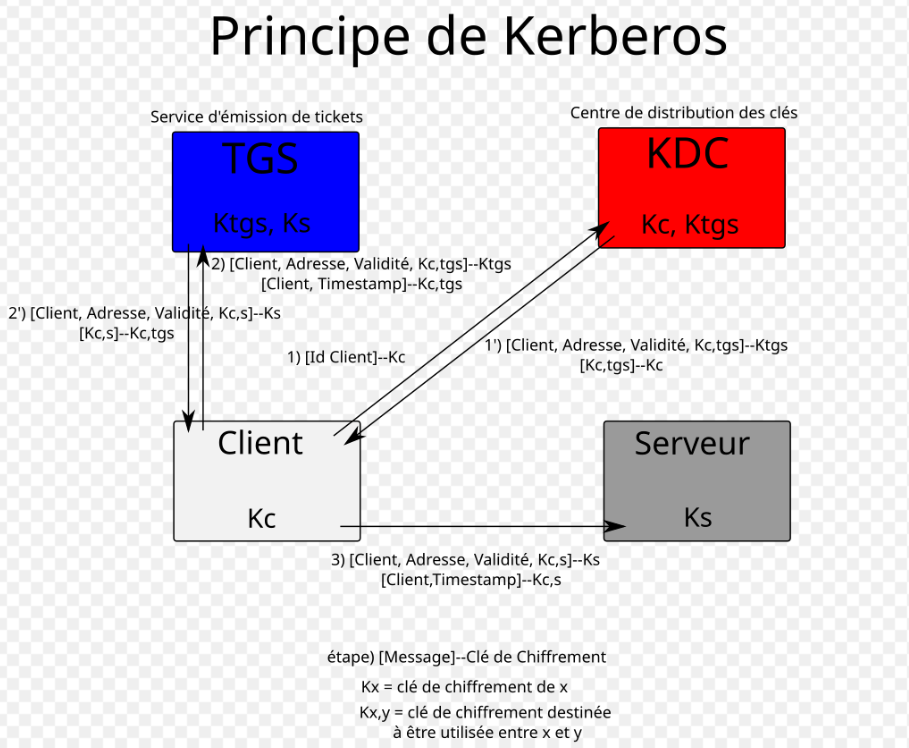
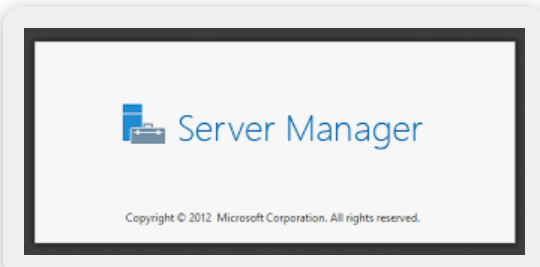

# ACTIVE DIRECTORY

## Sommaire

- [Introduction](#introduction)
- [Mise en place d'Active Directory](#mise-en-place-dactive-directory)
	- [Prérequis](#prerequis)
	- [Installation (GUI & PowerShell)](#installation)
	- [Promotion du serveur en Contrôleur de Domaine (DC)](#promotion-du-serveur-en-contr%C3%B4leur-de-domaine-dc)
- [Post-installation et vérifications de base](#post-installation-et-v%C3%A9rifications-de-base)
- [Gestion quotidienne (utilisateurs, groupes, OU, GPO)](#gestion-quotidienne-cr%C3%A9ation-et-administration-des-objets)
- [Comptes de service (gMSA)](#comptes-de-service)
- [Sauvegarde et restauration](#sauvegarde-et-restauration)
- [Réplication Active Directory](#r%C3%A9plication-active-directory)
	- [Concepts clés](#concepts-cl%C3%A9s)
	- [Sites et sous-r%C3%A9seaux](#sites-et-sous-r%C3%A9seaux)
	- [Outils et diagnostics](#outils-de-diagnostic-et-commandes-utiles)
- [FSMO (Flexible Single Master Operations)](#fsmo-flexible-single-master-operations)
- [Détails techniques (LDAP, Kerberos, NTDS, SYSVOL, GC, etc.)](#d%C3%A9tails-techniques-ldap-kerberos-ntds-sysvol-gc-etc)
- [Intégration d'outils et services courants](#int%C3%A9gration-doutils-et-services-courants)
- [Sécurité et bonnes pratiques](#s%C3%A9curit%C3%A9-et-bonnes-pratiques)
- [Checklist de mise en production](#checklist-de-mise-en-production)
- [Résolution de problèmes courants](#r%C3%A9solution-de-probl%C3%A8mes-courants)
- [Annexes — scripts & commandes utiles](#annexes--commandes-utiles)

<!-- NOTE: Les tags d'image ci-dessous sont des repères — remplacez-les par des captures réelles dans le dossier ./img/ -->
# ACTIVE DIRECTORY

## Sommaire

- [Introduction](#introduction)
- [Mise en place d'Active Directory](#mise-en-place-dactive-directory)
	- [Prérequis](#prerequis)
	- [Installation (GUI & PowerShell)](#installation)
	- [Promotion du serveur en Contrôleur de Domaine (DC)](#promotion-du-serveur-en-contr%C3%B4leur-de-domaine-dc)
- [Post-installation et vérifications de base](#post-installation-et-v%C3%A9rifications-de-base)
- [Gestion quotidienne (utilisateurs, groupes, OU, GPO)](#gestion-quotidienne-cr%C3%A9ation-et-administration-des-objets)
- [Comptes de service (gMSA)](#comptes-de-service)
- [Sauvegarde et restauration](#sauvegarde-et-restauration)
- [Réplication Active Directory](#r%C3%A9plication-active-directory)
	- [Concepts clés](#concepts-cl%C3%A9s)
	- [Sites et sous-r%C3%A9seaux](#sites-et-sous-r%C3%A9seaux)
	- [Outils et diagnostics](#outils-de-diagnostic-et-commandes-utiles)
- [FSMO (Flexible Single Master Operations)](#fsmo-flexible-single-master-operations)
- [Détails techniques (LDAP, Kerberos, NTDS, SYSVOL, GC, etc.)](#d%C3%A9tails-techniques-ldap-kerberos-ntds-sysvol-gc-etc)
- [Intégration d'outils et services courants](#int%C3%A9gration-doutils-et-services-courants)
- [Sécurité et bonnes pratiques](#s%C3%A9curit%C3%A9-et-bonnes-pratiques)
- [Checklist de mise en production](#checklist-de-mise-en-production)
- [Résolution de problèmes courants](#r%C3%A9solution-de-probl%C3%A8mes-courants)
- [Annexes — scripts & commandes utiles](#annexes--commandes-utiles)

<!-- NOTE: Les tags d'image ci-dessous sont des repères — remplacez-les par des captures réelles dans le dossier ./img/ -->

## Introduction

#### *Active Directory (AD)*


Active Directory, c'est le service d'annuaire signé Microsoft. Il centralise tout : utilisateurs, postes, groupes et ressources (imprimantes, partages, etc.). On y retrouve l'ensemble des objets du réseau stockés dans une base hiérarchique — pratique pour gérer les droits et l'accès.

Concrètement, AD sert à :

- gérer les comptes et leurs droits d'accès,
- authentifier les utilisateurs lors de leurs connexions,
- appliquer des politiques de sécurité à l'échelle d'un domaine,
- organiser les ressources de l'entreprise de façon logique.

En une phrase : AD, c'est le cœur de l'admin réseau Windows — il gère identités, accès et sécurité. C’est simple, mais essentiel.

#### *Domaine Active Directory*

Un domaine est l'unité de base d'Active Directory. Il rassemble des objets (utilisateurs, ordinateurs, groupes...) qui partagent la même base et les mêmes politiques.

Chaque domaine possède :

- un nom unique (par exemple : entreprise.local),
- un ou plusieurs contrôleurs de domaine (Domain Controllers) qui stockent et répliquent les données.

Les domaines peuvent être reliés entre eux pour former une forêt (voir plus bas).

#### *Forêt et Arbre Active Directory*

Un arbre est un ensemble de domaines liés hiérarchiquement, partageant un espace de noms DNS. Une forêt regroupe un ou plusieurs arbres et partage le schéma, le catalogue global et les relations d'approbation (trusts).

La forêt est donc l'unité logique la plus haute dans AD.


*schema represenstatif des forets et domaines*

#### *Contrôleur de Domaine (Domain Controller)*

Le contrôleur de domaine (DC) est le serveur principal d'un domaine AD. Il héberge la base NTDS.DIT et prend en charge :

- l'authentification (Kerberos/NTLM),
- la réplication vers les autres DC,
- la gestion des stratégies de sécurité.

Sans DC, AD ne fonctionne pas. Point final.

#### *Unité Organisationnelle (OU – Organizational Unit)*

L'OU est un conteneur logique pour organiser les objets. On s'en sert pour regrouper par service, déléguer l'administration ou appliquer des GPO sur des ensembles précis.

#### *Objets Active Directory*

Les objets sont les éléments gérés : chaque objet a des attributs (nom, mot de passe, mail...) et une catégorie.

Objets principaux :

- Utilisateur : compte humain ou de service.
- Groupe : ensemble d'utilisateurs pour appliquer des droits.
- Ordinateur : machine jointe au domaine.
- Imprimante, partage réseau, etc.

#### *Base de Données Active Directory (NTDS.DIT)*

La base principale est le fichier NTDS.DIT, stocké sur le DC. Il contient :

- les objets du domaine,
- leurs attributs,
- les informations de sécurité et de réplication.

Ce fichier est mis à jour en continu et répliqué entre DC.

Pour des détails sur LDAP, référez-vous à la section "Détails techniques".

#### *DN (Distinguished Name)*

Le DN est le nom unique d'un objet dans LDAP/AD. Il renseigne sa position dans l'arborescence.

```exemple
CN=Jean Dupont,OU=Informatique,DC=entreprise,DC=local
```

| Abréviation | Signification |
|--------------|---------------|
| CN | Common Name (nom de l’objet) |
| OU | Organizational Unit |
| DC | Domain Component |

#### *GPO (Group Policy Object)*

Les GPO sont des règles de configuration. Elles permettent de gérer et sécuriser automatiquement postes et utilisateurs (ex : politique de mot de passe, fond d'écran, désactivation de services...).

Pour une explication complète de Kerberos (TGT, KDC, tickets), voir la section "Détails techniques".

Pour la réplication (KCC, sites, inter-site), voir la section correspondante plus bas.

## Fonctionnement d'Active Directory

### Mise en place d'Active Directory

---
Contexte : on part du déploiement d'un DC Windows Server (ex. Windows Server 2022) — souvent dans une VM (Proxmox, ESXi, Hyper-V). Cette section détaille les prérequis, l'installation du rôle AD DS, la promotion en DC et les outils d'administration (PowerShell / RSAT).



### Prérequis

- Matériel recommandé (DC de test / petit site) : 2 vCPU, 4 Go RAM, disque 40 Go — adaptez en production selon la charge.
- OS : Windows Server 2016, 2019 ou 2022 (choisir le niveau fonctionnel adapté).

Réseau :

- Adresse IP statique sur le serveur (éviter DHCP pour un DC).
- Nom d'hôte unique lisible (ex : dc1-entreprise).
- DNS : le serveur doit résoudre son propre nom et les enregistrements SRV du domaine. En pratique, mettez comme DNS principal l'IP fixe du DC (ou 127.0.0.1 quand on sait ce qu'on fait) et configurez des forwarders vers des DNS publics ou internes.
- Horloge : NTP synchronisé (un décalage >5 min casse Kerberos).

Comptes et permissions :

- Compte local admin pour l'installation.
- Compte de domaine avec droits suffisants si on ajoute un DC à un domaine existant.

### Installation

Pour demarer l'installation il vous faudra vous demarer et vous connecter sur le serveur Windows lui et assigner une @IP statique.

1- Ouvrez le gestionnaire de serveur 


*Le Gestionnaire de serveur est natif a Windows Server, celui-ci permet de gerer et configurer les fonctionnalité du systeme (AD, DNS, DHCP...), ainsi que de superviser l'état general du serveur*

2 - Cliquez sur ajouter des roles et fonctionnalitées

3 - Selectionnez ***Installation basée sur un rôle ou une fonctionnalité***

4 - J'ai selectionnez **serveur local**

5 - Cochez le service **services AD DS** pour installer le role Active Directory




*Ici on a deja les roles et groupes par defaut*

Il vous faudra ajoutez le role ***Active Directory Domain Services (AD DS)*** pour faire de ce serveur le controleur de domaine

| | |
|---|---|
| | |
|||
|||


### Modules et outils d'administration (RSAT / PowerShell)

- Sur le serveur : l'installation du rôle AD DS installe généralement les outils d'administration. Modules PowerShell utiles : `ActiveDirectory` (Get-ADUser, New-ADUser...), `ADDSDeployment` (Install-ADDSForest...), `DnsServer` si besoin.
- Sur un poste Windows 10/11 : installez RSAT. Exemple PowerShell (Windows 10/11 modernes) :

```powershell
# Depuis une session PowerShell (admin) sur un poste Windows 10/11
Add-WindowsCapability -Online -Name "Rsat.ActiveDirectory.DS-LDS.Tools~~~~0.0.1.0"
```

- Sur un serveur Windows (pour le rôle et les outils) :

```powershell
Install-WindowsFeature AD-Domain-Services -IncludeManagementTools
Install-WindowsFeature RSAT-AD-PowerShell      # installe le module ActiveDirectory
Import-Module ActiveDirectory
Import-Module ADDSDeployment
```

### Installation du rôle AD DS et promotion en contrôleur de domaine

On peut passer par l'interface graphique ou PowerShell. La méthode PowerShell est reproductible et pratique pour les labs.

1) Installer le rôle AD DS :

```powershell
# Installer le rôle et les outils
Install-WindowsFeature AD-Domain-Services -IncludeManagementTools
Import-Module ADDSDeployment
```

2) Promotion — deux cas : création d'une nouvelle forêt (premier DC) ou ajout d'un DC à un domaine existant.

Cas A — Création d'une nouvelle forêt (premier DC) :

```powershell
# Exemple : nouvelle forêt "entreprise.local"
Install-ADDSForest -DomainName "entreprise.local" -DomainNetbiosName "ENTREPRISE" -InstallDNS -SafeModeAdministratorPassword (Read-Host -AsSecureString "Mot de passe DSRM")
```

Cas B — Ajouter un contrôleur de domaine à un domaine existant :

```powershell
# Exemple : joindre et promouvoir en DC additionnel
$cred = Get-Credential    # compte d'un administrateur de domaine
Install-ADDSDomainController -Credential $cred -DomainName "entreprise.local" -InstallDns -SafeModeAdministratorPassword (Read-Host -AsSecureString "Mot de passe DSRM")
```

Remarques : l'assistant graphique (Gestionnaire de serveur → Promouvoir ce serveur en contrôleur de domaine) propose les mêmes options — choix du niveau fonctionnel, installation DNS, GC et DSRM. Un redémarrage sera nécessaire.

### Post-installation et vérifications de base

- Vérifier la présence des enregistrements DNS (_msdcs, SRV, enregistrements A pour les DC).
- Exécuter ces contrôles :

```powershell
dcdiag /v
repadmin /replsummary
Get-ADDomainController -Filter * | Select Name,IPv4Address,Site,OperatingSystem
```

- Tester LDAP/LDAPS (ldp.exe) et Kerberos (klist, journaux d'événements).
- Configurer les forwarders DNS et valider la réplication entre DCs.

---
## Détails techniques

Ici on rentre un peu plus dans le technique pour comprendre comment fonctionne le systeme.

### LDAP

- LDAP (Lightweight Directory Access Protocol) est le protocole d'accès aux annuaires. Il permet de rechercher, lire et modifier les objets dans AD. Le schéma AD définit les classes d'objets (user, computer, group...) et leurs attributs (cn, sn, member, userPrincipalName...).
- Quand on écrit des scripts ou qu'on intègre des services, connaître les attributs (memberOf, objectGUID, sAMAccountName, userAccountControl) est indispensable.

### Kerberos — authentification par tickets



- Kerberos est le protocole principal d'authentification dans AD. Lors d'une connexion, l'utilisateur obtient un TGT (Ticket Granting Ticket) du KDC (Key Distribution Center) qui tourne sur un DC, puis il reçoit des tickets de service pour accéder aux ressources.
- Point crucial : l'heure doit être synchronisée via NTP ; si la différence dépasse 5 minutes, Kerberos peut échouer.



### DNS et enregistrements SRV

- AD repose beaucoup sur DNS. Les enregistrements SRV et _msdcs servent à localiser les services (ex : _ldap._tcp.dc._msdcs.entreprise.local). Sans DNS correct, les machines ne trouvent pas les DC.
- Vérifiez que les zones DNS sont intégrées à AD si vous voulez la réplication automatique des enregistrements.

### NTDS.DIT, journaux et architecture de stockage

- NTDS.DIT est la base ESE qui contient tous les objets AD. Les fichiers de transaction (EDB.log) assurent l'intégrité et sont rejoués au démarrage.
- Emplacements clés :
	- NTDS.DIT (base de données)
	- EDB.chk (checkpoint)
	- edbxxxxx.log (fichiers de transaction)

- Ne déplacez pas ces fichiers sans procédure et sauvegarde ; faites des sauvegardes System State régulières.

### SYSVOL et NETLOGON

- Le dossier SYSVOL contient les scripts de démarrage, les définitions de GPO et autres éléments pour les clients. Depuis Windows Server 2008, SYSVOL est souvent répliqué via DFSR plutôt que FRS.
- Le partage NETLOGON publie les scripts d'ouverture de session et les enregistrements nécessaires à la découverte des DC.

```
https://www.it-connect.fr/chapitres/le-partage-sysvol-et-la-replication/
```

### Global Catalog (Catalogue global)

- Le Global Catalog (GC) contient une copie partielle de tous les objets de la forêt (les attributs fréquemment recherchés) et permet les recherches cross-domaines et l'authentification universelle.
- Le GC est indispensable si vous avez plusieurs domaines dans une forêt ou utilisez des comptes universal.

### Comptes et jetons d'accès (Token)

- Quand un utilisateur s'authentifie, son token (liste des SIDs des groupes) est créé. Les changements d'appartenance n'apparaissent dans le token qu'après une nouvelle connexion (ou `klist purge`/`logoff`).

### RID, Pool RID et rôle RID Master

- Le RID Master fournit aux DC des pools de RID (Relative Identifier) combinés avec le SID du domaine pour créer des SIDs d'objets uniques.
- Si le RID Master est indisponible trop longtemps, la création d'objets peut échouer partout ailleurs.

### Réplication — KCC, partenaires, topologie

- KCC (Knowledge Consistency Checker) calcule automatiquement la topologie de réplication intra-site.
- Protocoles : RPC par défaut pour intra-site, et RPC/SMTP (rare) pour inter-site. Depuis 2003, on peut configurer RPC sur TCP.
- Concepts clés : USN, Invocation ID, Lingering Objects, Tombstone Lifetime.

### Tombstone, Garbage Collection et autorité de restauration

- Quand on supprime un objet, il devient une "tombstone" et reste récupérable pendant la "tombstone lifetime". Après, il est purgé.
- Restauration :
	- Non-autoritaire : restaurer System State et laisser la réplication faire le reste.
	- Autoritaire : utile si on veut forcer la version restaurée ; on utilise `ntdsutil` puis on laisse répliquer.

### Sécurité des communications — LDAPs et LDAPS

- Pour chiffrer LDAP, activez LDAPS (LDAPS over SSL/TLS) via certificats (AD CS ou PKI externe). Assurez-vous d'avoir des certificats valides et le port 636 accessible.

### Horloge et Kerberos (W32Time)

- Le PDC Emulator doit être la source de temps pour la forêt/domaine et se synchroniser sur une source NTP fiable. Si l'heure est désynchronisée, Kerberos casse.

## Annexes — exemples de scripts et aides pratiques

### Script : rapport santé AD (exemple simple)

```powershell
# HealthCheck-AD.ps1
Import-Module ActiveDirectory
Write-Host "=== DC list ==="
Get-ADDomainController -Filter * | Select Name,Site,IPv4Address
Write-Host "\n=== DCDiag summary ==="
dcdiag /v | Out-Host
Write-Host "\n=== Replication summary ==="
repadmin /replsummary | Out-Host
```

### Script : provisionnement basique (OU + utilisateur + groupe)

```powershell
Import-Module ActiveDirectory
New-ADOrganizationalUnit -Name "Informatique" -Path "DC=entreprise,DC=local"
New-ADGroup -Name "IT-Admins" -GroupScope Global -Path "OU=Informatique,DC=entreprise,DC=local"
New-ADUser -Name "Alice Admin" -SamAccountName aadmin -UserPrincipalName aadmin@entreprise.local -Path "OU=Informatique,DC=entreprise,DC=local" -AccountPassword (ConvertTo-SecureString "P@ssw0rd!" -AsPlainText -Force) -Enabled $true
Add-ADGroupMember -Identity "IT-Admins" -Members aadmin
```

### Promotion du serveur en Contrôleur de Domaine (DC)

Après l'installation du rôle AD DS, il faut promouvoir le serveur en contrôleur de domaine. Deux méthodes : GUI ou PowerShell.

#### Méthode graphique

1. Dans le Gestionnaire de serveur, cliquez sur "Promouvoir ce serveur en contrôleur de domaine".
2. Choisissez "Ajouter une nouvelle forêt" si c'est le premier DC, et renseignez le nom DNS (ex. entreprise.local).
3. Sélectionnez le niveau fonctionnel de la forêt et du domaine (Windows Server 2016/2019/2022 selon le besoin).
4. Cochez "Serveur DNS" et "Catalogue global (GC)" si nécessaire.
5. Définissez le mot de passe DSRM.
6. Vérifiez les prérequis et redémarrez quand l'assistant le demande.

#### Méthode PowerShell (rapide et reproductible)

1. Ouvrir PowerShell en admin.
2. Installer le rôle AD DS :

```powershell
Install-WindowsFeature AD-Domain-Services -IncludeManagementTools
```

3. Promouvoir le serveur (nouvelle forêt) :

```powershell
Import-Module ADDSDeployment
Install-ADDSForest -DomainName "entreprise.local" -InstallDNS -DomainNetbiosName "ENTREPRISE" -SafeModeAdministratorPassword (Read-Host -AsSecureString "Password DSRM")
```

4. Redémarrer si nécessaire.

Remarques : assurez-vous d'avoir une IP statique avant la promotion. Le serveur doit utiliser comme DNS principal lui-même (127.0.0.1 ou son IP) et en secondaire un forwarder interne/externe.

## Post-installation et vérifications de base

- Vérifiez que le service DNS fonctionne et que la zone (ex. entreprise.local) contient _msdcs_, SRV et enregistrements A des DC.
- Commandes utiles :

```powershell
dcdiag /v
repadmin /replsummary
Get-ADDomainController -Filter * | Select Name,IPv4Address,OperatingSystem
```

- Testez LDAP/Kerberos (ldp.exe, klist) et l'accès utilisateur.

## Gestion quotidienne (création et administration des objets)

### Utilisateurs et Groupes

Créer un utilisateur avec PowerShell :

```powershell
New-ADUser -Name "Jean Dupont" -GivenName Jean -Surname Dupont -SamAccountName jdupont -UserPrincipalName jdupont@entreprise.local -AccountPassword (Read-Host -AsSecureString "Mot de passe") -Enabled $true
```

Groupes : privilégiez les groupes de sécurité pour les permissions et les groupes de distribution pour la messagerie. On va aussi dire : faites attention au nesting.

### Unités Organisationnelles (OU) et délégation

- Organisez par OU (ex : OU=Users, OU=Computers, OU=Service, OU=Admins).
- Déléguez via l'assistant Delegation of Control pour limiter les droits d'admin.

### GPO (Group Policy Objects)

- Utilisez GPMC pour créer, lier et filtrer les GPO.
- Bonnes pratiques :
	- Liez les GPO au niveau des OU pour réduire l'impact.
	- Nommez explicitement vos GPO (ex : "GPO-PasswordPolicy-2025").
	- Testez avec "Group Policy Modeling" et "Group Policy Results".

Exemples :

```powershell
# Forcer l'application d'une GPO
gpupdate /force

# Résultat des GPO pour un utilisateur/ordinateur
gpresult /r
```

### Joindre un poste au domaine

- Sur le poste : Panneau de configuration > Système > Modifier les paramètres > Changer > Domain et saisissez `entreprise.local`.
- Avec PowerShell (admin local) :

```powershell
Add-Computer -DomainName "entreprise.local" -Credential (Get-Credential) -Restart
```

### Comptes de service

- Préférez les Managed Service Accounts (gMSA) pour éviter de gérer des mots de passe manuellement.

Création d'un gMSA :

```powershell
New-ADServiceAccount -Name "svc_sql_gmsa" -DNSHostName "entreprise.local" -PrincipalsAllowedToRetrieveManagedPassword "SQLServersGroup"
Install-ADServiceAccount -Identity svc_sql_gmsa
```

## Sauvegarde et restauration

- Sauvegardez l'état système (System State) sur chaque DC avec Windows Server Backup.
- Restauration : non-autoritaire (laisser répliquer) ou autoritaire (`ntdsutil`) selon le besoin.

Exemple de sauvegarde système :

```powershell
wbadmin start systemstatebackup -backuptarget:D:\ -quiet
```

## Réplication Active Directory

### Concepts clés

- Réplication intra-site : fréquente et rapide.
- Réplication inter-site : planifiée, optimisée pour liens lents.
- KCC calcule la topologie intra-site.
- Bridgehead servers : points d'entrée pour la réplication inter-site.

### Sites et sous-réseaux

- Définissez vos Sites dans "Active Directory Sites and Services" et associez les sous-réseaux IP (ex : 192.168.10.0/24).
- Configurez les site links : coûts, horaires et intervalles.

### Outils de diagnostic et commandes utiles

- `repadmin /replsummary` : résumé de la réplication.
- `repadmin /showrepl <DCName>` : détail des partenaires.
- `repadmin /syncall <DCName> /A /e /P` : forcer la sync.
- `dcdiag /v` : tests santé du DC.
- `nltest /dsgetdc:entreprise.local` : localiser un DC.

### Délai et paramètres

- Les intervalles inter-site sont en minutes par défaut et ajustables.
- N'augmentez pas trop la fréquence sur des liens à faible bande passante.

### Gestion des conflits et objets supprimés

- AD utilise USN et timestamps pour résoudre les conflits.
- "Tombstone lifetime" : période pendant laquelle un objet supprimé est récupérable.

## FSMO (Flexible Single Master Operations)

- Rôles : Schema Master, Domain Naming Master, RID Master, PDC Emulator, Infrastructure Master.
- Vérifier détenteurs :

```powershell
Get-ADForest | Format-List SchemaMaster,DomainNamingMaster
Get-ADDomain | Format-List PDCEmulator,RIDMaster,InfrastructureMaster
```

- Déplacer un rôle : `Move-ADDirectoryServerOperationMasterRole`.

## Intégration d'outils et services courants

- RSAT : installez sur les postes d'administration pour obtenir ADUC, AD Sites and Services, GPMC.
- PowerShell ActiveDirectory module pour l'automatisation.
- DCDiag, Repadmin, Event Viewer pour le diagnostic.
- Windows Admin Center pour une console web.
- DHCP : autoriser le serveur DHCP dans AD avant distribution.
- PKI / AD CS pour intégrer des certificats (Smartcard, VPN, LDAPS).
- NPS pour RADIUS.
- DFS pour espaces de noms partagés et réplication.

### Exemples rapides d'utilisation d'outils

```powershell
# Lister tous les contrôleurs
Get-ADDomainController -Filter * | Select Name,Site,IPv4Address

# Vérifier la réplication
repadmin /replsummary

# Tester la santé d'un DC
dcdiag /s:MonDC
```

## Sécurité et bonnes pratiques

- Séparez les comptes d'administration (usage quotidien vs admin global).
- Limitez les membres de `Domain Admins` et `Enterprise Admins`.
- Activez la journalisation et surveillez événements critiques (4625, 4740...).
- Synchronisation horaire : PDC Emulator sur une source externe fiable.
- Utilisez LAPS pour gérer les mots de passe locaux.
- Appliquez des politiques de mot de passe robustes et MFA pour l'accès admin.

## Checklist de mise en production

## Checklist de mise en production

|  Élément à vérifier | Détails / Statut |
|-----------------------|------------------|
| **1. IP statique et nom d'hôte configurés** | Vérifier que chaque DC possède une IP fixe et un nom d’hôte cohérent (ex : `dc1-entreprise`). |
| **2. DNS interne configuré et vérifié** | Le serveur DNS doit résoudre le domaine interne (`entreprise.local`) et les enregistrements SRV (_msdcs). Tester avec `nslookup`. |
| **3. Au moins deux contrôleurs de domaine pour la redondance** | S’assurer qu’un second DC est opérationnel et que la réplication fonctionne (`repadmin /replsummary`). |
| **4. Plan de sauvegarde System State et tests de restauration** | Planifier des sauvegardes régulières avec `wbadmin` et tester une restauration sur un DC de test. |
| **5. Sites & Services configurés avec sous-réseaux corrects** | Créer les sites AD selon la topologie réseau et associer chaque sous-réseau au bon site. |
| **6. FSMO roles documentés et plans de transfert** | Identifier les rôles FSMO (`Get-ADForest`, `Get-ADDomain`) et documenter leur emplacement et procédure de bascule. |
| **7. GPOs testés en pré-production** | Vérifier les GPO avec `gpresult` / `Group Policy Modeling` avant déploiement global. |
| **8. Processus de délégation et comptes de service (gMSA) en place** | Mettre en place la délégation via les OU et utiliser des comptes gMSA pour les services critiques. |

## Résolution de problèmes courants

- Problème : réplication échoue. Actions : vérifier réseau, DNS, `repadmin /showrepl`, `dcdiag`, l'heure système.
- Problème : utilisateur ne peut pas s'authentifier. Actions : vérifier appartenance au domaine, état du compte, verrouillage, `nltest`, Kerberos et DNS.

## Annexes — commandes utiles

- `Get-ADUser -Filter *` : lister les utilisateurs.
- `Get-ADGroupMember -Identity "GroupeNom"` : lister membres d'un groupe.
- `Move-ADDirectoryServerOperationMasterRole -Identity "TargetDC" -OperationMasterRole PDCEmulator` : déplacer un rôle FSMO.

## Introduction

#### *Active Directory (AD)*


Active Directory, c'est le service d'annuaire signé Microsoft. Il centralise tout : utilisateurs, postes, groupes et ressources (imprimantes, partages, etc.). On y retrouve l'ensemble des objets du réseau stockés dans une base hiérarchique — pratique pour gérer les droits et l'accès.

Concrètement, AD sert à :

- gérer les comptes et leurs droits d'accès,
- authentifier les utilisateurs lors de leurs connexions,
- appliquer des politiques de sécurité à l'échelle d'un domaine,
- organiser les ressources de l'entreprise de façon logique.

En une phrase : AD, c'est le cœur de l'admin réseau Windows — il gère identités, accès et sécurité. C’est simple, mais essentiel.

#### *Domaine Active Directory*

Un domaine est l'unité de base d'Active Directory. Il rassemble des objets (utilisateurs, ordinateurs, groupes...) qui partagent la même base et les mêmes politiques.

Chaque domaine possède :

- un nom unique (par exemple : entreprise.local),
- un ou plusieurs contrôleurs de domaine (Domain Controllers) qui stockent et répliquent les données.

Les domaines peuvent être reliés entre eux pour former une forêt (voir plus bas).

#### *Forêt et Arbre Active Directory*

Un arbre est un ensemble de domaines liés hiérarchiquement, partageant un espace de noms DNS. Une forêt regroupe un ou plusieurs arbres et partage le schéma, le catalogue global et les relations d'approbation (trusts).

La forêt est donc l'unité logique la plus haute dans AD.


*schema represenstatif des forets et domaines*

#### *Contrôleur de Domaine (Domain Controller)*

Le contrôleur de domaine (DC) est le serveur principal d'un domaine AD. Il héberge la base NTDS.DIT et prend en charge :

- l'authentification (Kerberos/NTLM),
- la réplication vers les autres DC,
- la gestion des stratégies de sécurité.

Sans DC, AD ne fonctionne pas. Point final.

#### *Unité Organisationnelle (OU – Organizational Unit)*

L'OU est un conteneur logique pour organiser les objets. On s'en sert pour regrouper par service, déléguer l'administration ou appliquer des GPO sur des ensembles précis.

#### *Objets Active Directory*

Les objets sont les éléments gérés : chaque objet a des attributs (nom, mot de passe, mail...) et une catégorie.

Objets principaux :

- Utilisateur : compte humain ou de service.
- Groupe : ensemble d'utilisateurs pour appliquer des droits.
- Ordinateur : machine jointe au domaine.
- Imprimante, partage réseau, etc.

#### *Base de Données Active Directory (NTDS.DIT)*

La base principale est le fichier NTDS.DIT, stocké sur le DC. Il contient :

- les objets du domaine,
- leurs attributs,
- les informations de sécurité et de réplication.

Ce fichier est mis à jour en continu et répliqué entre DC.

Pour des détails sur LDAP, référez-vous à la section "Détails techniques".

#### *DN (Distinguished Name)*

Le DN est le nom unique d'un objet dans LDAP/AD. Il renseigne sa position dans l'arborescence.

```exemple
CN=Jean Dupont,OU=Informatique,DC=entreprise,DC=local
```

| Abréviation | Signification |
|--------------|---------------|
| CN | Common Name (nom de l’objet) |
| OU | Organizational Unit |
| DC | Domain Component |

#### *GPO (Group Policy Object)*

Les GPO sont des règles de configuration. Elles permettent de gérer et sécuriser automatiquement postes et utilisateurs (ex : politique de mot de passe, fond d'écran, désactivation de services...).

Pour une explication complète de Kerberos (TGT, KDC, tickets), voir la section "Détails techniques".

Pour la réplication (KCC, sites, inter-site), voir la section correspondante plus bas.

## Fonctionnement d'Active Directory

### Mise en place d'Active Directory

---
Contexte : on part du déploiement d'un DC Windows Server (ex. Windows Server 2022) — souvent dans une VM (Proxmox, ESXi, Hyper-V). Cette section détaille les prérequis, l'installation du rôle AD DS, la promotion en DC et les outils d'administration (PowerShell / RSAT).


### Prérequis

- Matériel recommandé (DC de test / petit site) : 2 vCPU, 4 Go RAM, disque 40 Go — adaptez en production selon la charge.
- OS : Windows Server 2016, 2019 ou 2022 (choisir le niveau fonctionnel adapté).

Réseau :

- Adresse IP statique sur le serveur (éviter DHCP pour un DC).
- Nom d'hôte unique lisible (ex : dc1-entreprise).
- DNS : le serveur doit résoudre son propre nom et les enregistrements SRV du domaine. En pratique, mettez comme DNS principal l'IP fixe du DC (ou 127.0.0.1 quand on sait ce qu'on fait) et configurez des forwarders vers des DNS publics ou internes.
- Horloge : NTP synchronisé (un décalage >5 min casse Kerberos).

Comptes et permissions :

- Compte local admin pour l'installation.
- Compte de domaine avec droits suffisants si on ajoute un DC à un domaine existant.

### Installation

Pour demarer l'installation il vous faudra vous demarer et vous connecter sur le serveur Windows lui et assigner une @IP statique.

1- Ouvrez le gestionnaire de serveur 


*Le Gestionnaire de serveur est natif a Windows Server, celui-ci permet de gerer et configurer les fonctionnalité du systeme (AD, DNS, DHCP...), ainsi que de superviser l'état general du serveur*

2 - Cliquez sur ajouter des roles et fonctionnalitées

3 - Selectionnez ***Installation basée sur un rôle ou une fonctionnalité***

4 - J'ai selectionnez **serveur local**

5 - Cochez le service **services AD DS** pour installer le role Active Directory


*Ici on a deja les roles et groupes par defaut*

Il vous faudra ajoutez le role ***Active Directory Domain Services (AD DS)*** pour faire de ce serveur le controleur de domaine

| | |
|---|---|
| | |
|||
|||


### Modules et outils d'administration (RSAT / PowerShell)

- Sur le serveur : l'installation du rôle AD DS installe généralement les outils d'administration. Modules PowerShell utiles : `ActiveDirectory` (Get-ADUser, New-ADUser...), `ADDSDeployment` (Install-ADDSForest...), `DnsServer` si besoin.
- Sur un poste Windows 10/11 : installez RSAT. Exemple PowerShell (Windows 10/11 modernes) :

```powershell
# Depuis une session PowerShell (admin) sur un poste Windows 10/11
Add-WindowsCapability -Online -Name "Rsat.ActiveDirectory.DS-LDS.Tools~~~~0.0.1.0"
```

- Sur un serveur Windows (pour le rôle et les outils) :

```powershell
Install-WindowsFeature AD-Domain-Services -IncludeManagementTools
Install-WindowsFeature RSAT-AD-PowerShell      # installe le module ActiveDirectory
Import-Module ActiveDirectory
Import-Module ADDSDeployment
```

### Installation du rôle AD DS et promotion en contrôleur de domaine

On peut passer par l'interface graphique ou PowerShell. La méthode PowerShell est reproductible et pratique pour les labs.

1) Installer le rôle AD DS :

```powershell
# Installer le rôle et les outils
Install-WindowsFeature AD-Domain-Services -IncludeManagementTools
Import-Module ADDSDeployment
```

2) Promotion — deux cas : création d'une nouvelle forêt (premier DC) ou ajout d'un DC à un domaine existant.

Cas A — Création d'une nouvelle forêt (premier DC) :

```powershell
# Exemple : nouvelle forêt "entreprise.local"
Install-ADDSForest -DomainName "entreprise.local" -DomainNetbiosName "ENTREPRISE" -InstallDNS -SafeModeAdministratorPassword (Read-Host -AsSecureString "Mot de passe DSRM")
```

Cas B — Ajouter un contrôleur de domaine à un domaine existant :

```powershell
# Exemple : joindre et promouvoir en DC additionnel
$cred = Get-Credential    # compte d'un administrateur de domaine
Install-ADDSDomainController -Credential $cred -DomainName "entreprise.local" -InstallDns -SafeModeAdministratorPassword (Read-Host -AsSecureString "Mot de passe DSRM")
```

Remarques : l'assistant graphique (Gestionnaire de serveur → Promouvoir ce serveur en contrôleur de domaine) propose les mêmes options — choix du niveau fonctionnel, installation DNS, GC et DSRM. Un redémarrage sera nécessaire.

### Post-installation et vérifications de base

- Vérifier la présence des enregistrements DNS (_msdcs, SRV, enregistrements A pour les DC).
- Exécuter ces contrôles :

```powershell
dcdiag /v
repadmin /replsummary
Get-ADDomainController -Filter * | Select Name,IPv4Address,Site,OperatingSystem
```

- Tester LDAP/LDAPS (ldp.exe) et Kerberos (klist, journaux d'événements).
- Configurer les forwarders DNS et valider la réplication entre DCs.

---

Cette section fournit une procédure claire pour installer AD DS, promouvoir un DC et préparer les outils. Les exemples PowerShell sont pensés pour un lab ; adaptez mots de passe, noms DNS et options selon votre environnement.

##### Compte

- Il faudra un compte administrateur sur le serveur.

### Installation (mode graphique)

1. Ouvrir le Gestionnaire de serveur :

2. Cliquer sur **Ajouter des roles**.
3. Sélectionner "Services de domaine Active Directory (AD DS)" et suivre l'assistant.

## Détails techniques

Ici on rentre un peu plus dans le technique pour comprendre ce qui se passe sous le capot.

### LDAP

- LDAP (Lightweight Directory Access Protocol) est le protocole d'accès aux annuaires. Il permet de rechercher, lire et modifier les objets dans AD. Le schéma AD définit les classes d'objets (user, computer, group...) et leurs attributs (cn, sn, member, userPrincipalName...).
- Quand on écrit des scripts ou qu'on intègre des services, connaître les attributs (memberOf, objectGUID, sAMAccountName, userAccountControl) est indispensable.

### Kerberos — authentification par tickets


- Kerberos est le protocole principal d'authentification dans AD. Lors d'une connexion, l'utilisateur obtient un TGT (Ticket Granting Ticket) du KDC (Key Distribution Center) qui tourne sur un DC, puis il reçoit des tickets de service pour accéder aux ressources.
- Point crucial : l'heure doit être synchronisée via NTP ; si la différence dépasse 5 minutes, Kerberos peut échouer.


### DNS et enregistrements SRV

- AD repose beaucoup sur DNS. Les enregistrements SRV et _msdcs servent à localiser les services (ex : _ldap._tcp.dc._msdcs.entreprise.local). Sans DNS correct, les machines ne trouvent pas les DC.
- Vérifiez que les zones DNS sont intégrées à AD si vous voulez la réplication automatique des enregistrements.

### NTDS.DIT, journaux et architecture de stockage

- NTDS.DIT est la base ESE qui contient tous les objets AD. Les fichiers de transaction (EDB.log) assurent l'intégrité et sont rejoués au démarrage.
- Emplacements clés :
	- NTDS.DIT (base de données)
	- EDB.chk (checkpoint)
	- edbxxxxx.log (fichiers de transaction)

- Ne déplacez pas ces fichiers sans procédure et sauvegarde ; faites des sauvegardes System State régulières.

### SYSVOL et NETLOGON

- Le dossier SYSVOL contient les scripts de démarrage, les définitions de GPO et autres éléments pour les clients. Depuis Windows Server 2008, SYSVOL est souvent répliqué via DFSR plutôt que FRS.
- Le partage NETLOGON publie les scripts d'ouverture de session et les enregistrements nécessaires à la découverte des DC.

```
https://www.it-connect.fr/chapitres/le-partage-sysvol-et-la-replication/
```

### Global Catalog (Catalogue global)

- Le Global Catalog (GC) contient une copie partielle de tous les objets de la forêt (les attributs fréquemment recherchés) et permet les recherches cross-domaines et l'authentification universelle.
- Le GC est indispensable si vous avez plusieurs domaines dans une forêt ou utilisez des comptes universal.

### Comptes et jetons d'accès (Token)

- Quand un utilisateur s'authentifie, son token (liste des SIDs des groupes) est créé. Les changements d'appartenance n'apparaissent dans le token qu'après une nouvelle connexion (ou `klist purge`/`logoff`).

### RID, Pool RID et rôle RID Master

- Le RID Master fournit aux DC des pools de RID (Relative Identifier) combinés avec le SID du domaine pour créer des SIDs d'objets uniques.
- Si le RID Master est indisponible trop longtemps, la création d'objets peut échouer partout ailleurs.

### Réplication — KCC, partenaires, topologie

- KCC (Knowledge Consistency Checker) calcule automatiquement la topologie de réplication intra-site.
- Protocoles : RPC par défaut pour intra-site, et RPC/SMTP (rare) pour inter-site. Depuis 2003, on peut configurer RPC sur TCP.
- Concepts clés : USN, Invocation ID, Lingering Objects, Tombstone Lifetime.

### Tombstone, Garbage Collection et autorité de restauration

- Quand on supprime un objet, il devient une "tombstone" et reste récupérable pendant la "tombstone lifetime". Après, il est purgé.
- Restauration :
	- Non-autoritaire : restaurer System State et laisser la réplication faire le reste.
	- Autoritaire : utile si on veut forcer la version restaurée ; on utilise `ntdsutil` puis on laisse répliquer.

### Sécurité des communications — LDAPs et LDAPS

- Pour chiffrer LDAP, activez LDAPS (LDAPS over SSL/TLS) via certificats (AD CS ou PKI externe). Assurez-vous d'avoir des certificats valides et le port 636 accessible.

### Horloge et Kerberos (W32Time)

- Le PDC Emulator doit être la source de temps pour la forêt/domaine et se synchroniser sur une source NTP fiable. Si l'heure est désynchronisée, Kerberos casse.

## Annexes — exemples de scripts et aides pratiques

### Script : rapport santé AD (exemple simple)

```powershell
# HealthCheck-AD.ps1
Import-Module ActiveDirectory
Write-Host "=== DC list ==="
Get-ADDomainController -Filter * | Select Name,Site,IPv4Address
Write-Host "\n=== DCDiag summary ==="
dcdiag /v | Out-Host
Write-Host "\n=== Replication summary ==="
repadmin /replsummary | Out-Host
```

### Script : provisionnement basique (OU + utilisateur + groupe)

```powershell
Import-Module ActiveDirectory
New-ADOrganizationalUnit -Name "Informatique" -Path "DC=entreprise,DC=local"
New-ADGroup -Name "IT-Admins" -GroupScope Global -Path "OU=Informatique,DC=entreprise,DC=local"
New-ADUser -Name "Alice Admin" -SamAccountName aadmin -UserPrincipalName aadmin@entreprise.local -Path "OU=Informatique,DC=entreprise,DC=local" -AccountPassword (ConvertTo-SecureString "P@ssw0rd!" -AsPlainText -Force) -Enabled $true
Add-ADGroupMember -Identity "IT-Admins" -Members aadmin
```

### Promotion du serveur en Contrôleur de Domaine (DC)

Après l'installation du rôle AD DS, il faut promouvoir le serveur en contrôleur de domaine. Deux méthodes : GUI ou PowerShell.

#### Méthode graphique

1. Dans le Gestionnaire de serveur, cliquez sur "Promouvoir ce serveur en contrôleur de domaine".
2. Choisissez "Ajouter une nouvelle forêt" si c'est le premier DC, et renseignez le nom DNS (ex. entreprise.local).
3. Sélectionnez le niveau fonctionnel de la forêt et du domaine (Windows Server 2016/2019/2022 selon le besoin).
4. Cochez "Serveur DNS" et "Catalogue global (GC)" si nécessaire.
5. Définissez le mot de passe DSRM.
6. Vérifiez les prérequis et redémarrez quand l'assistant le demande.

#### Méthode PowerShell (rapide et reproductible)

1. Ouvrir PowerShell en admin.
2. Installer le rôle AD DS :

```powershell
Install-WindowsFeature AD-Domain-Services -IncludeManagementTools
```

3. Promouvoir le serveur (nouvelle forêt) :

```powershell
Import-Module ADDSDeployment
Install-ADDSForest -DomainName "entreprise.local" -InstallDNS -DomainNetbiosName "ENTREPRISE" -SafeModeAdministratorPassword (Read-Host -AsSecureString "Password DSRM")
```

4. Redémarrer si nécessaire.

Remarques : assurez-vous d'avoir une IP statique avant la promotion. Le serveur doit utiliser comme DNS principal lui-même (127.0.0.1 ou son IP) et en secondaire un forwarder interne/externe.

## Post-installation et vérifications de base

- Vérifiez que le service DNS fonctionne et que la zone (ex. entreprise.local) contient _msdcs_, SRV et enregistrements A des DC.
- Commandes utiles :

```powershell
dcdiag /v
repadmin /replsummary
Get-ADDomainController -Filter * | Select Name,IPv4Address,OperatingSystem
```

- Testez LDAP/Kerberos (ldp.exe, klist) et l'accès utilisateur.

## Gestion quotidienne (création et administration des objets)

### Utilisateurs et Groupes

Créer un utilisateur avec PowerShell :

```powershell
New-ADUser -Name "Jean Dupont" -GivenName Jean -Surname Dupont -SamAccountName jdupont -UserPrincipalName jdupont@entreprise.local -AccountPassword (Read-Host -AsSecureString "Mot de passe") -Enabled $true
```

Groupes : privilégiez les groupes de sécurité pour les permissions et les groupes de distribution pour la messagerie. On va aussi dire : faites attention au nesting.

### Unités Organisationnelles (OU) et délégation

- Organisez par OU (ex : OU=Users, OU=Computers, OU=Service, OU=Admins).
- Déléguez via l'assistant Delegation of Control pour limiter les droits d'admin.

### GPO (Group Policy Objects)

- Utilisez GPMC pour créer, lier et filtrer les GPO.
- Bonnes pratiques :
	- Liez les GPO au niveau des OU pour réduire l'impact.
	- Nommez explicitement vos GPO (ex : "GPO-PasswordPolicy-2025").
	- Testez avec "Group Policy Modeling" et "Group Policy Results".

Exemples :

```powershell
# Forcer l'application d'une GPO
gpupdate /force

# Résultat des GPO pour un utilisateur/ordinateur
gpresult /r
```

### Joindre un poste au domaine

- Sur le poste : Panneau de configuration > Système > Modifier les paramètres > Changer > Domain et saisissez `entreprise.local`.
- Avec PowerShell (admin local) :

```powershell
Add-Computer -DomainName "entreprise.local" -Credential (Get-Credential) -Restart
```

### Comptes de service

- Préférez les Managed Service Accounts (gMSA) pour éviter de gérer des mots de passe manuellement.

Création d'un gMSA :

```powershell
New-ADServiceAccount -Name "svc_sql_gmsa" -DNSHostName "entreprise.local" -PrincipalsAllowedToRetrieveManagedPassword "SQLServersGroup"
Install-ADServiceAccount -Identity svc_sql_gmsa
```

## Sauvegarde et restauration

- Sauvegardez l'état système (System State) sur chaque DC avec Windows Server Backup.
- Restauration : non-autoritaire (laisser répliquer) ou autoritaire (`ntdsutil`) selon le besoin.

Exemple de sauvegarde système :

```powershell
wbadmin start systemstatebackup -backuptarget:D:\ -quiet
```

## Réplication Active Directory

### Concepts clés

- Réplication intra-site : fréquente et rapide.
- Réplication inter-site : planifiée, optimisée pour liens lents.
- KCC calcule la topologie intra-site.
- Bridgehead servers : points d'entrée pour la réplication inter-site.

### Sites et sous-réseaux

- Définissez vos Sites dans "Active Directory Sites and Services" et associez les sous-réseaux IP (ex : 192.168.10.0/24).
- Configurez les site links : coûts, horaires et intervalles.

### Outils de diagnostic et commandes utiles

- `repadmin /replsummary` : résumé de la réplication.
- `repadmin /showrepl <DCName>` : détail des partenaires.
- `repadmin /syncall <DCName> /A /e /P` : forcer la sync.
- `dcdiag /v` : tests santé du DC.
- `nltest /dsgetdc:entreprise.local` : localiser un DC.

### Délai et paramètres

- Les intervalles inter-site sont en minutes par défaut et ajustables.
- N'augmentez pas trop la fréquence sur des liens à faible bande passante.

### Gestion des conflits et objets supprimés

- AD utilise USN et timestamps pour résoudre les conflits.
- "Tombstone lifetime" : période pendant laquelle un objet supprimé est récupérable.

## FSMO (Flexible Single Master Operations)

- Rôles : Schema Master, Domain Naming Master, RID Master, PDC Emulator, Infrastructure Master.
- Vérifier détenteurs :

```powershell
Get-ADForest | Format-List SchemaMaster,DomainNamingMaster
Get-ADDomain | Format-List PDCEmulator,RIDMaster,InfrastructureMaster
```

- Déplacer un rôle : `Move-ADDirectoryServerOperationMasterRole`.

## Intégration d'outils et services courants

- RSAT : installez sur les postes d'administration pour obtenir ADUC, AD Sites and Services, GPMC.
- PowerShell ActiveDirectory module pour l'automatisation.
- DCDiag, Repadmin, Event Viewer pour le diagnostic.
- Windows Admin Center pour une console web.
- DHCP : autoriser le serveur DHCP dans AD avant distribution.
- PKI / AD CS pour intégrer des certificats (Smartcard, VPN, LDAPS).
- NPS pour RADIUS.
- DFS pour espaces de noms partagés et réplication.

### Exemples rapides d'utilisation d'outils

```powershell
# Lister tous les contrôleurs
Get-ADDomainController -Filter * | Select Name,Site,IPv4Address

# Vérifier la réplication
repadmin /replsummary

# Tester la santé d'un DC
dcdiag /s:MonDC
```

## Sécurité et bonnes pratiques

- Séparez les comptes d'administration (usage quotidien vs admin global).
- Limitez les membres de `Domain Admins` et `Enterprise Admins`.
- Activez la journalisation et surveillez événements critiques (4625, 4740...).
- Synchronisation horaire : PDC Emulator sur une source externe fiable.
- Utilisez LAPS pour gérer les mots de passe locaux.
- Appliquez des politiques de mot de passe robustes et MFA pour l'accès admin.

## Checklist de mise en production

1. IP statique et nom d'hôte configurés.
2. DNS interne configuré et vérifié.
3. Au moins deux contrôleurs de domaine pour la redondance.
4. Plan de sauvegarde System State et tests de restauration.
5. Sites & Services configurés avec sous-réseaux corrects.
6. FSMO roles documentés et plans de transfert.
7. GPOs testés en pré-production.
8. Processus de délégation et comptes de service (gMSA) en place.

## Résolution de problèmes courants

- Problème : réplication échoue. Actions : vérifier réseau, DNS, `repadmin /showrepl`, `dcdiag`, l'heure système.
- Problème : utilisateur ne peut pas s'authentifier. Actions : vérifier appartenance au domaine, état du compte, verrouillage, `nltest`, Kerberos et DNS.

## Annexes — commandes utiles

- `Get-ADUser -Filter *` : lister les utilisateurs.
- `Get-ADGroupMember -Identity "GroupeNom"` : lister membres d'un groupe.
- `Move-ADDirectoryServerOperationMasterRole -Identity "TargetDC" -OperationMasterRole PDCEmulator` : déplacer un rôle FSMO.

## Conclusion

Cette documentation donne une vue complète et opérationnelle pour installer, administrer et maintenir Active Directory. Adaptez niveaux fonctionnels, intervalles de réplication et règles de sécurité à votre contexte. Documentez chaque changement et testez les procédures de sauvegarde/restauration avant mise en production.

Petite remarque pratique : dans mon labo à Limoges, j'ai souvent vu que configurer le DNS local avant toute promotion évite 80% des problèmes — faites-le en premier, vraiment.

Exemple concret : déploiement effectué le 12-06-2024 sur la VM "dc1-entreprise" hébergée à Limoges.

---

Changelog:

- v1.0 — Reformulation complète pour ton équipe; ajouts : métadonnées, remarque pratique et exemple concret.

- Corrections mineures de mise en forme.
